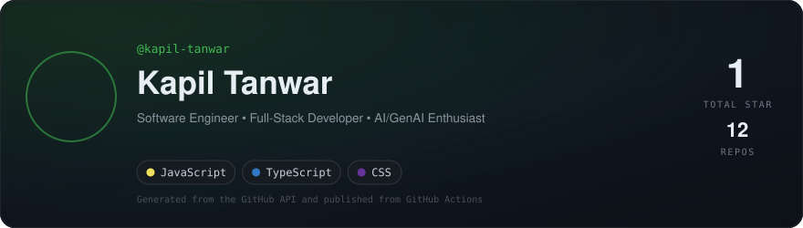
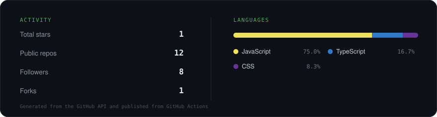

 

---

---

## 🚀 About Me

I'm a **B.Tech Information Technology student at IIIT Sonepat**, focused on building reliable and scalable software systems.

- B.Tech IT @ IIIT Sonepat — 2027
- - Interested in Backend Engineering, Full-Stack Development & GenAI
- - Experienced in REST APIs, databases, authentication & RBAC
- Building AI/LLM-powered applications
- Working with Docker and AWS
- 700+ DSA problems solved
- LeetCode 1850+

---

## 🛠️ Tech Stack

---

## 📊 GitHub Statistics

<!-- GitHub Activity + Languages -->

  

<!-- Contribution Streak -->

---

## 🐍 Contribution Graph

<picture>
  <source
    media="(prefers-color-scheme: dark)"
    srcset="https://raw.githubusercontent.com/kapil-tanwar/kapil-tanwar/output/github-snake-dark.svg"
  />
  <source
    media="(prefers-color-scheme: light)"
    srcset="https://raw.githubusercontent.com/kapil-tanwar/kapil-tanwar/output/github-snake.svg"
  />
  
</picture>

---

### 💬 Let's build something worth shipping.

**[Portfolio](https://port-folio-mqvn.vercel.app/) • [LinkedIn](https://www.linkedin.com/in/kapil-tanwar-686436279/) • [Email](mailto:kapiltanwar340@gmail.com)**

